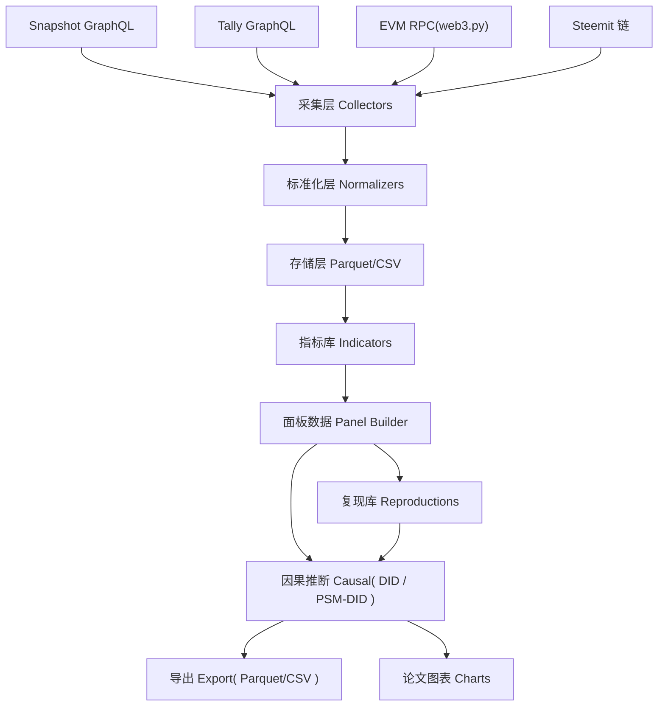
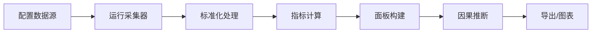

# 架构设计

## 系统概述

OnChainGov 采用「分层管道」架构，数据从多个异构来源流入，经过标准化、指标计算、因果推断，最终导出为研究就绪的面板数据。整体为 Python 包 + CLI + Notebook 的组合形态，无中心化服务依赖，全部可在本地运行。



## 技术栈

| 类别 | 技术 | 用途 |
|------|------|------|
| 语言 | Python 3.10+ | 主开发语言 |
| 数据获取 | gql / httpx | GraphQL 与 HTTP 请求 |
| 链上访问 | web3.py | EVM 链上数据 |
| 数据处理 | polars | 高性能列式处理 |
| 计量 | linearmodels | DID、面板回归 |
| PSM | scikit-learn | 倾向得分匹配 |
| 可视化 | matplotlib / plotly | 论文图表 |
| 交互 | Streamlit | 研究仪表盘 |
| 打包 | pyproject.toml (setuptools) | 包管理 |
| 测试 | pytest | 单元测试 |
| 复现 | jupyter notebook | 论文复现 |

## 项目结构（建议）

```
onchaingov/
├── pyproject.toml
├── src/onchaingov/
│   ├── __init__.py
│   ├── collectors/          # 采集器
│   │   ├── base.py          # 采集器基类
│   │   ├── snapshot.py      # Snapshot GraphQL
│   │   ├── tally.py         # Tally GraphQL
│   │   ├── evm_rpc.py       # 链上 RPC
│   │   └── steemit.py       # Steemit 采集器 (v2)
│   ├── normalizers/         # 标准化
│   │   └── schemas.py       # 统一数据 schema
│   ├── indicators/          # 指标库
│   │   ├── participation.py # 治理参与度
│   │   ├── concentration.py # 投票权集中度
│   │   └── token_incentive.py # 代币激励四维指标
│   ├── panel/               # 面板构建
│   │   └── builder.py
│   ├── causal/              # 因果推断
│   │   ├── did.py           # 双重差分
│   │   ├── psm_did.py       # PSM-DID (v2)
│   │   ├── placebo.py       # placebo 检验
│   │   └── event_study.py   # 事件研究
│   ├── export/              # 导出
│   │   ├── parquet.py
│   │   └── charts.py        # 论文图表
│   ├── reproductions/       # 复现库 (v2)
│   │   └── jom2025_steemit/
│   └── cli.py               # 命令行入口
├── notebooks/               # 复现与示例 notebook
├── dashboard/               # Streamlit 仪表盘 (v3)
├── tests/
└── data/                    # 数据目录 (gitignore)
```

## 核心模块/组件

### 采集层 (Collectors)
各数据源通过统一基类实现，输出统一的原始事件记录。Snapshot/Tally 走 GraphQL，EVM 走 web3.py RPC，Steemit 走其链上接口。

### 标准化层 (Normalizers)
将异构原始数据映射为统一 schema（提案、投票、代币转账、用户活动等），保证下游计算的一致性。

### 指标库 (Indicators)
三个指标族：
- **治理参与度**: 投票率、提案参与用户数、参与频率等
- **投票权集中度**: Herfindahl-Hirschman Index、Gini、投票权份额分布
- **代币激励四维指标**: creation（内容创作激励）、curation（策展激励）、novelty（新颖度）、ownership share（所有权份额）

### 因果推断 (Causal)
提供标准计量模板，接收面板数据，输出处理效应估计与诊断。DID 为核心，PSM-DID、placebo、事件研究为扩展。

### 复现库 (Reproductions)
存放旗舰论文的复现 notebook 与数据构建脚本，作为整个工具链的 sanity check。

## 关键流程

### 端到端研究管道


## 设计决策

| 决策 | 选择 | 理由 |
|------|------|------|
| 数据格式 | Parquet 作为主格式，CSV 兼容导出 | 列式高效 + 研究生态兼容 |
| 计算引擎 | polars 而非 pandas | 大规模面板性能与内存友好 |
| 因果推断 | linearmodels 而非 statsmodels | 面板计量 API 更专业 |
| 交付形态 | Python 包 + CLI + Notebook | 兼顾研究者复用与快速上手 |
| 存储 | 本地文件，无数据库 | 研究数据量级无需数据库，简化部署 |
| 架构 | 分层管道而非微服务 | 研究工具，本地单机即可，避免运维负担 |
